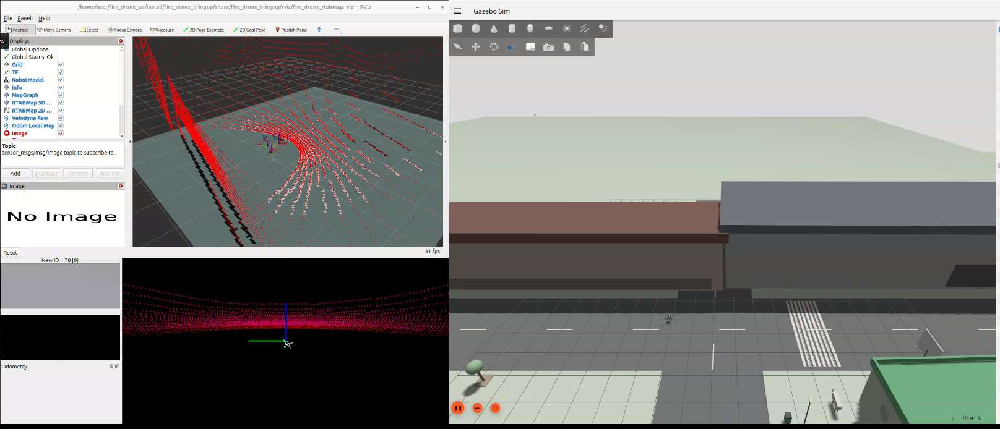
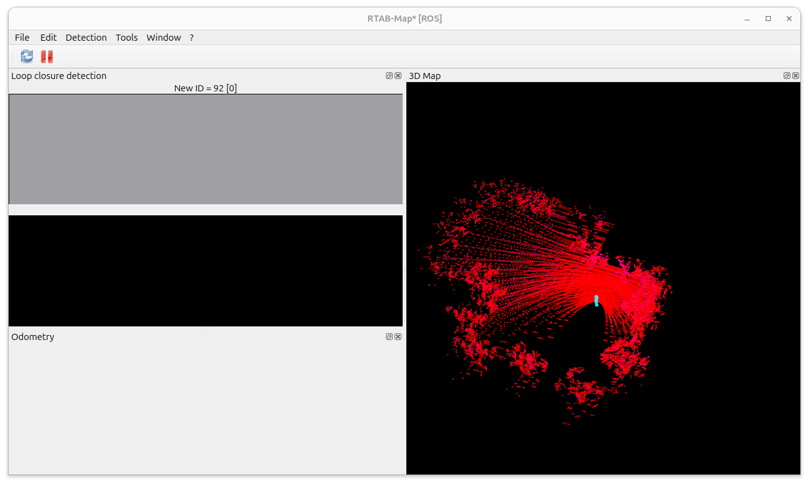
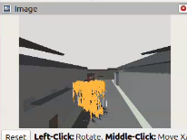
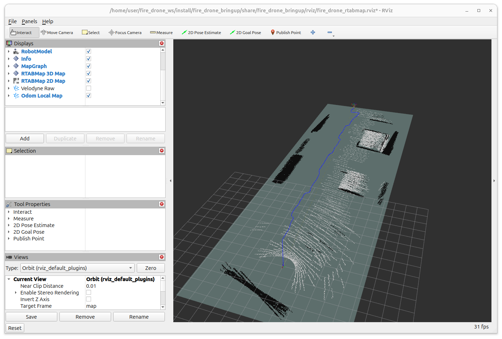
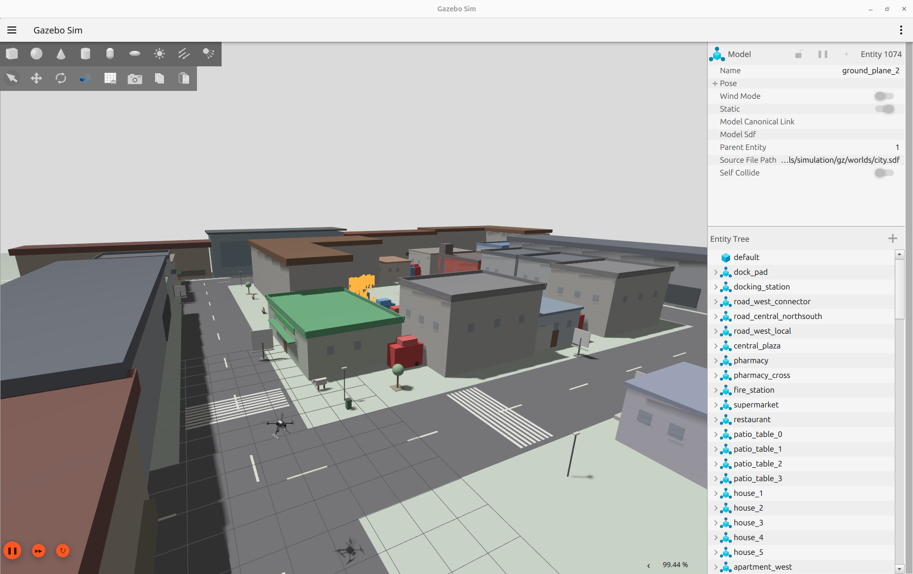

# Fire Drone Gazebo RTAB-Map - Customized PX4

This repository contains a complete ROS 2 autonomous fire-drone simulation framework integrated with a customized PX4 environment.

Customized PX4 Repository:  
https://github.com/hadi-shokor/PX4-Autopilot-fire-drone

Official PX4 Repository:  
https://github.com/PX4/PX4-Autopilot

---

# Overview

This project combines:

- PX4 SITL
- Gazebo Harmonic
- ROS 2 Jazzy
- RTAB-Map SLAM
- Frontier-based autonomous exploration
- Autonomous drone navigation
- Fire detection and tracking
- Custom fire simulation
- Velodyne LiDAR integration
- Monocular RGB camera integration

The system was designed for autonomous fire search, mapping, navigation, and fire localization experiments in simulation.

---

# Repository Structure

## fire_drone_bringup

Contains:

- PX4 ↔ ROS 2 bridge launch files
- TF publishers
- Runtime URDF generation
- Velodyne timestamp adaptation
- Complete simulation launch setup

---

## fire_drone_controller

Contains:

- Offboard PX4 control
- Autonomous waypoint following
- Nav2 path following

---

## fire_drone_navigation

Contains:

- Frontier exploration
- Nav2 planning integration
- Height-filtered occupancy mapping
- Autonomous exploration launch files

---

## fire_drone_perception

Contains:

- Fire detection node
- Fire tracking logic
- Camera-based fire localization

---

## fire_drone_sim_cpp

Contains:

- Simulated fire source generator
- Fire visualization and spawning logic

---

## fire_drone_msgs

Custom ROS 2 messages for:

- Fire detection
- Suppression status
- Navigation communication

---

## px4_msgs

ROS 2 PX4 message definitions used for PX4 communication.

Based on the official PX4 ROS message package:

https://github.com/PX4/px4_msgs

---

# Features

- Autonomous drone exploration
- RTAB-Map 3D mapping
- Frontier-based exploration
- Autonomous Nav2 navigation
- PX4 OFFBOARD control
- Real-time fire detection
- Fire tracking and autonomous approach
- Custom Gazebo fire simulation
- Velodyne point cloud processing
- Monocular camera streaming
- PX4 ↔ ROS 2 integration

---

# Screenshots

## Full System Launch



---

## RTAB-Map Mapping



---

## Fire Detection



---

## Autonomous Exploration



---

## Custom City World



---

# Demo Video


Video file:

[](https://drive.google.com/drive/folders/1yTuVdaP5kOcOwuDsaz31qTsn66X5uuhQ?usp=sharing)

If GitHub supports inline preview on your browser/device, you can open the video directly from the repository.

---

# Requirements

- Ubuntu 24.04
- ROS 2 Jazzy
- Gazebo Harmonic
- PX4 SITL
- RTAB-Map ROS

Additional setup instructions can be found in the official PX4 documentation.

---

# Build Instructions

## Clone the workspace

```bash
mkdir -p ~/fire_drone_ws/src
cd ~/fire_drone_ws/src

git clone https://github.com/hadi-shokor/Fire_Drone_Gazebo_RtabMap-Customized-PX4-.git .
```

---

## Build the workspace

```bash
cd ~/fire_drone_ws
colcon build
source install/setup.bash
```

---

# Running the System

Example launch:

```bash
ros2 launch fire_drone_bringup full_fire_mapping_mission.launch.py
```

---

# Notes

This project depends on the customized PX4 repository linked above.

The PX4 repository contains:

- Custom X500 fire drone model
- Velodyne LiDAR integration
- Monocular camera integration
- Custom city simulation world
- Gazebo simulation assets

---

# Author

Hadi Shokor
